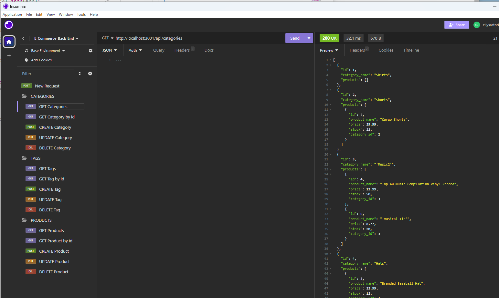

# E-Commerce_Back_End-ESchottler

## Description

The back end for an e-commerce site. Using Express.js API and configured to use Sequelize to interact with a MySQL database

## Installation

Open the app in your code editor, using the integrated terminal run npm i.  Update the .env file with your user information. Run the application's db/schema.sql file in your MySql Shell or workbench to create your database. In the code terminal, execute the command npm run seed.  Next run node server.js.  Now the code is available to test in Insomnia or Postman, or platform of your choice.

## Usage

View a walkthrough video of this app at: https://drive.google.com/file/d/1-nAonsVh8DM9OaUR6zinvysDYEs6-IRR/view

A screenshot of this application in use:   

## Credits

This project was created with the criteria and guidance from UofM-VIRT-FSF-PT-08-2023-U-LOLC. 
Starter code for this project can be found at https://github.com/coding-boot-camp/fantastic-umbrella . 
This application is using https://insomnia.rest/ and https://www.screencastify.com/ to demonstrate usage.

## License
N/A